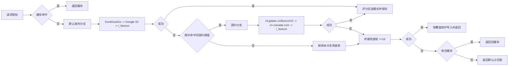

# 分批修复计划（更新版）

- 更新日期：2026-04-09
- 适用范围：`Bookmark-Backup-3.0`
- 总目标：优先保证“书签树安全兜底 + 失败可见”，并保持改动面可控。

## 1. 已完成（本阶段）

1. 实时备份说明文案改为实验提醒
- 已补充：短时间可能生成很多版本、可能增加空间占用、后续可能提供快照开关。
- 已保留并恢复：原有彩色示例说明（数量变化/结构变化）。

2. 初始化上传与切换备份防撞车
- 初始化上传进行中时，切换备份不立即执行。
- 连续触发只保留一次待执行请求，初始化上传结束后再尝试执行一次。

3. 实时自动备份队列化
- 保持已有队列与合并触发机制，避免高频变化并发冲突。

4. 恢复/撤销后置校验（轻量）已接入
- 已接入范围：覆盖恢复、补丁恢复、覆盖撤销、补丁撤销，以及中断面板的继续/回滚。
- 校验口径：统一走结构校验（内部做目标快照归一化后比对），不依赖节点 ID。
- 失败行为：校验失败会中断成功收尾，保留未完成事务，交由中断恢复面板处理。

5. 中断恢复面板已接入“导出备份包（2个 HTML）”
- 已接入入口：主 UI 弹窗面板、HTML 历史页面板。
- 导出内容固定两份：开始前快照（start）+ 目标快照（target）。
- 作用：继续/回滚都无法稳定完成时，给用户可落地的本地兜底材料。

6. 恢复事务失败状态机已补齐
- 已落地阶段：`continue_failed`、`rollback_failed`、`locked_incident`。
- 触发规则：继续失败记 `continue_failed`；回滚失败记 `rollback_failed`；两者都失败时自动进入 `locked_incident`。
- 锁定态策略：继续/回滚按钮禁用；保留导出备份包与“手动解锁（停止提醒）”入口。

7. 中断提醒阈值与解锁确认策略已调整
- 多次提醒阈值统一为 5 次。
- 第 5 次提醒会弹出二级确认：提供“手动备份（2个HTML）”与“停止提醒并解锁”入口，先提醒备份再解锁。
- 超过第 5 次后不再自动弹出中断面板；后续新的恢复/撤销不再被旧事务阻塞（按自动放行处理）。

8. 失败原因已落入备份历史（可见化）
- 后台会为恢复/撤销失败追加 `status=error` 的历史记录。
- 记录内容包含：会话 ID、动作（继续/回滚）、阶段、错误码、错误信息、校验模式/差异摘要（有则写入）。
- 历史页已补 `type=revert` 展示徽章，避免都被当成普通自动备份。

9. 中断面板失败信息增强 + 手动导出入口增强
- 主 UI 与 HTML 历史页面板都新增“最近失败”摘要（动作/阶段/错误码/错误信息）。
- 导出按钮支持手动兜底：只要事务快照齐全（start + target）即可导出，覆盖失败态与崩溃中断场景。
- `locked_incident` 文案明确提示：先导出备份包，再决定下一步。

10. 失败分类口径切换为“三类”（新套版）
- 统一分类：`算法错误` / `浏览器限制或环境错误` / `其他错误`。
- 中断恢复面板“最近失败”按三类展示（保留动作与阶段，不再主打错误码）。
- 备份历史失败文案按三类输出；原始错误码与细节继续保留在后台日志与记录字段中用于排查。

11. 切代口径改造（已完成）
- 覆盖恢复 / 覆盖撤销 / 中断恢复继续与回滚中的覆盖路径，统一切到新“比较代”。
- 完全初始化与清空全部历史时，重置比较代状态，避免脏边界残留。
- 同代继续沿用浏览器 ID 口径；跨代首条自动做内容映射对齐后再统计，避免 ID 重建导致的新增/删除膨胀。
- 当前变化（主 UI / HTML）+ 手动导出 + 自动归档 + 历史 `changes_data_*` 全链路接入代口径。
- `changes_data_*` 升级为 schema v2，写入代/基线代/签名；读取端先校验，不一致自动回退重算。

### 1.1 切代范围矩阵（已补齐，2026-04-10）

统一原则（确认口径）：
- 不做“全局去 ID”。
- 同代比较继续使用浏览器 ID（性能与稳定性优先）。
- 仅在“跨代首条”启用内容对齐后再比较（解决覆盖恢复/覆盖撤销后的 ID 重建膨胀）。

已覆盖（代码已接入）：
1. 代状态切换与重置
- 覆盖恢复、覆盖撤销、中断恢复里走覆盖路径时会切到新代。
- 清空历史、删到空历史、完全初始化（reset）会重置代状态与边界标记。

2. 备份前统计与状态卡片
- 备份成功前后的差异统计统一走“按代比较”。
- 主 UI 状态卡片读取这条统计链路，因此跨代首条不会再把纯移动误判成大规模增删。

3. 当前变化（HTML）三视图与树预览
- 简略/详细/集合三视图先走同一份稳定态结果再渲染。
- 命中“统计仅结构变化，但树里出现增删”时，只做一次对齐重算兜底，避免高频重算。

4. 当前变化导出链路
- 手动导出（HTML/JSON）与自动归档共用同一套按代差异构建结果。
- 详细视图导出保留所见即所得展开态，但差异统计口径与页面保持一致。

5. 备份历史变化数据写入（`changes_data_*`）
- 备份成功时写入 schema v2：比较代、基线代、跨代标记、签名、变化条目、集合视图子树。
- 记录写入时已按代比较，不再把跨代首条误写成膨胀增删。

6. 备份历史变化数据读取与回退
- 读取 `changes_data_*` 先做代与签名校验；一致才复用。
- 校验失败或旧 schema 会自动回退到实时重算，避免脏数据污染展示。

7. “当前变化导出”与“备份历史记录”隔离
- 当前变化手动导出/自动归档只产出导出文件，不会反向写入或覆盖 `syncHistory` 记录。
- 备份历史记录仅由“备份成功流程”写入，避免导出行为污染历史统计。

待补齐/待观察（不阻塞本轮）：
1. 主 UI 恢复预览与导入合并预览
- 当前预览链路是“当前树 vs 目标树”独立口径，不依赖历史基线代。
- 这条链路原则上不受切代影响，但需继续观察其统计文案与执行后统计是否完全一致。

2. 旧历史数据兼容提示
- 历史旧记录若缺少 schema v2 元信息，已能自动回退重算。
- 还可补一条轻提示，告知“该记录使用兼容重算口径”，减少用户困惑（后续可选）。

3. 回归用例清单沉淀
- 需要把“覆盖恢复/覆盖撤销后首条、首条后下一条、清空历史后首条、reset 后首条”固化成手工回归清单，避免后续回归漏掉跨代边界。

## 2. 下一批要做（剩余项）

1. 三类失败分类稳定性观察（可选）
- 当前口径已统一为：算法错误 / 浏览器限制或环境错误 / 其他错误。
- 暂不再扩细面向用户的错误码展示，先观察分类准确性与可理解性。

2. 预演差异口径对齐（后续项）
- 继续评估是否统一主 UI / HTML / 撤销预演统计口径，减少边界场景数字差异。

3. 同步锁与导出成功误报（暂继续搁置）
- 按当前讨论继续观察，不并入本轮修复。

## 2.1 先讨论不实施：恢复/撤销统一校验与历史标记（草案）

1. 现状确认（已核对）
- 恢复到历史版本（覆盖恢复/补丁恢复）会尝试写入一条 `type=restore` 的历史记录。
- 撤销到上次备份（覆盖撤销/补丁撤销）当前不会新增一条独立历史记录。

2. 统一目标（讨论口径）
- 四种场景统一使用“快照 vs 快照”后置核对，不依赖节点 ID。
- 统一输出：成功/失败 + 明确失败原因（阶段 + 原因码）。
- 不新增重型校验卡片，只做内部兜底与历史状态落地。

3. 统一校验算法（草案）
- 取目标快照：本次操作实际要达到的目标树。
- 取结果快照：操作完成后实时 `getTree` 的当前树。
- 做结构规范化后比较（忽略 id/parentId，仅按目录结构、标题、URL、顺序、根容器属性比较）。
- 输出校验结论：`pass` / `mismatch` / `verify_error`。

4. 历史标记策略（草案）
- 恢复场景：沿用现有 `type=restore` 记录，在记录上补充校验结果字段。
- 撤销场景：新增 `type=revert` 记录（建议），把覆盖撤销/补丁撤销也纳入历史成功/失败可见化。
- 若不新增 `type=revert`，则至少在控制台与恢复结果中明确给出校验结论（次优方案）。

5. 失败原因归一化（草案）
- `apply_delete_failed`（删除阶段失败）
- `apply_create_failed`（创建阶段失败）
- `apply_move_failed`（移动/排序阶段失败）
- `apply_update_failed`（修改阶段失败）
- `verify_mismatch`（执行完成但结果与目标快照不一致）
- `verify_exception`（核对过程自身异常）

6. 本草案明确不做
- 不恢复旧版复杂校验卡片。
- 不要求用户手工修复差异。
- 不处理“中断恢复面板”已覆盖的中断场景。

7. 预演口径差异（补充结论）
- 根节点映射口径差异：当前按场景保留差异（主 UI 面向外部来源更严格；插件内部两套依赖已存 ID），暂不强制统一。
- 差异统计算法口径：纳入后续兜底计划，评估是否统一为一套统计口径，避免不同入口预演数字轻微不一致。

## 2.2 先讨论不实施：中断恢复面板失败后流程（草案）

1. 统一入口
- 覆盖恢复/补丁恢复/覆盖撤销/补丁撤销，任一执行失败即进入中断恢复面板。
- 来源不区分：历史记录、HTML、JSON 都按同一入口处理（失败即停机进面板）。
- 结束动作（继续或回滚）执行完后必须做一次“目标快照 vs 当前快照”核对；核对失败同样回到中断面板。

2. 面板状态机
- `pending_decision`：首次失败，等待用户选“继续”或“回滚”。
- `continue_failed`：继续失败，记录失败阶段与原因码。
- `rollback_failed`：回滚失败，记录失败阶段与原因码。
- `locked_incident`：继续与回滚都失败（或重复同签名失败），进入故障锁定态，停止自动重试。

3. 继续/回滚后的校验规则
- 继续成功 + 校验通过：结束事务，写成功结果。
- 继续成功 + 校验失败：记 `verify_mismatch`，回到中断面板。
- 回滚成功 + 校验通过：结束事务，标记“已回到开始前状态”。
- 回滚成功 + 校验失败：记 `verify_mismatch`，回到中断面板。
- 说明：这一步校验是“二次校验”，用于防止继续/回滚看似完成但结果仍不一致。

4. 预览信息并入失败说明（你要求的“失败在哪里”）
- 复用现有预演输出（预期变化摘要与目标快照信息）。
- 面板展示两列：
- 预演期望：本次应达到的变化结果。
- 实际失败：失败阶段（删除/创建/移动/更新/核对）+ 原因码 + 原始错误摘要。
- 目标：让用户能看懂“预演说会发生什么”和“实际卡在哪一步”。

5. 究极兜底导出（本地）
- 在 `locked_incident` 状态提供“导出备份包（HTML）”按钮（命名按此固定）。
- 备份包固定导出两份快照：
- 开始前快照（start）
- 目标快照（target）
- 附带元信息：事务 ID、策略、失败链路、原因码、时间戳、预演摘要。
- 作用：即使继续/回滚都无效，也能保留完整证据与可回放材料。

6. 交互边界
- 故障锁定态下不再自动执行继续/回滚。
- 提供“仅结束本次事务（不改数据）”出口，避免用户被无限卡死。

7. 后续对齐项（新增）
- 预演差异统计口径对齐：作为后续任务单独评估，不影响本轮“失败停机 + 二次校验 + 备份包导出”主流程。

## 3. 明确搁置（保持不变）

1. 重复监听问题（先不动，避免牵一发动全身）。
2. 备份并发入口全统一大队列（先不做全链路重构）。
3. 启动自愈清理（先搁置）。
4. 备份提醒模块修正（先搁置）。
5. 快照备份总开关（先搁置）。
6. 默认策略改为覆盖（先搁置）。

## 4. 本批验收口径

1. 四种恢复/撤销场景出现关键失败时，控制台能看到明确阶段和原因。  
2. 不再出现关键失败被吞后继续写“成功态”的流程。  
3. 轻量后置核对仅用于内部兜底，不引入重型校验卡片。  
4. 中断恢复仍由现有中断恢复面板处理，不新增重复机制。  

## 5. 跨项目追加：图标分支瀑布统一计划（2026-04-10）

1. 适用范围（本节为跨项目统一口径）
- `Bookmark-Record-Recommend`
- `Bookmark-Canvas`
- `Bookmark-Backup-3.0`

2. 本轮已确认决策（固定）
- 默认先走海外分支，不做手动切换。
- 分支重判时机只在两处：
- 首次安装后的首批图标拉取（初始大波）。
- 后续“新增书签”增量批次开始时。
- 运行中的普通请求不来回切分支，避免抖动。

3. 源头顺序（完整路径）
- 海外分支：`DuckDuckGo -> Google S2 -> /_favicon`
- 国内分支：`t3.gstatic.cn/faviconV2 -> cn.cravatar.com -> /_favicon`
- 说明：`/_favicon` 两个分支都放在末尾兜底。

4. 探针规则（被动探针）
- 只使用真实请求结果做探针，不额外发“测试请求”。
- 窗口大小：最近 `20` 次请求。
- 硬失败定义：`超时` / `000` / `5xx`。
- `404` 不计入硬失败。
- 切国内条件（满足任一）：
- 最近 20 次硬失败 `>=10`。
- 连续硬失败 `>=7`。
- 分支一旦在该批次确定，本批次内锁定，不做中途回切。

5. 质量与覆盖保护
- 第一轮质量门槛：`>=96`。
- 第二轮门槛：`>=32`。
- 第三轮终极兜底：`>=16`。
- `16x16` 仅用于兜底填空（尤其是用户实际打开标签页后回填链路）。
- 低质量禁止覆盖高质量：
- `<32` 不覆盖已存在 `>=32`。
- 新图尺寸小于旧图尺寸时，不覆盖旧图。

6. 缓存收敛策略
- 持久层每个域名只保留 1 张最终确认图标。
- 中间候选（评分过程中的白底图/低分图/失败候选）不入持久层，请求结束即丢弃。
- 失败标记继续保留 TTL 机制。

7. 三项目改造落点（后续执行范围）
- 每个项目的 `history_html/history.js`：统一源顺序、探针窗口与阈值、分支锁定时机。
- 每个项目的 `background.js`：统一“标签页回填”防降级规则（避免高清被低清覆盖）。

8. 横向流程图（统一版）

---

备注：本文件持续滚动更新；每完成一批同步刷新“已完成 / 下一批 / 搁置”。
