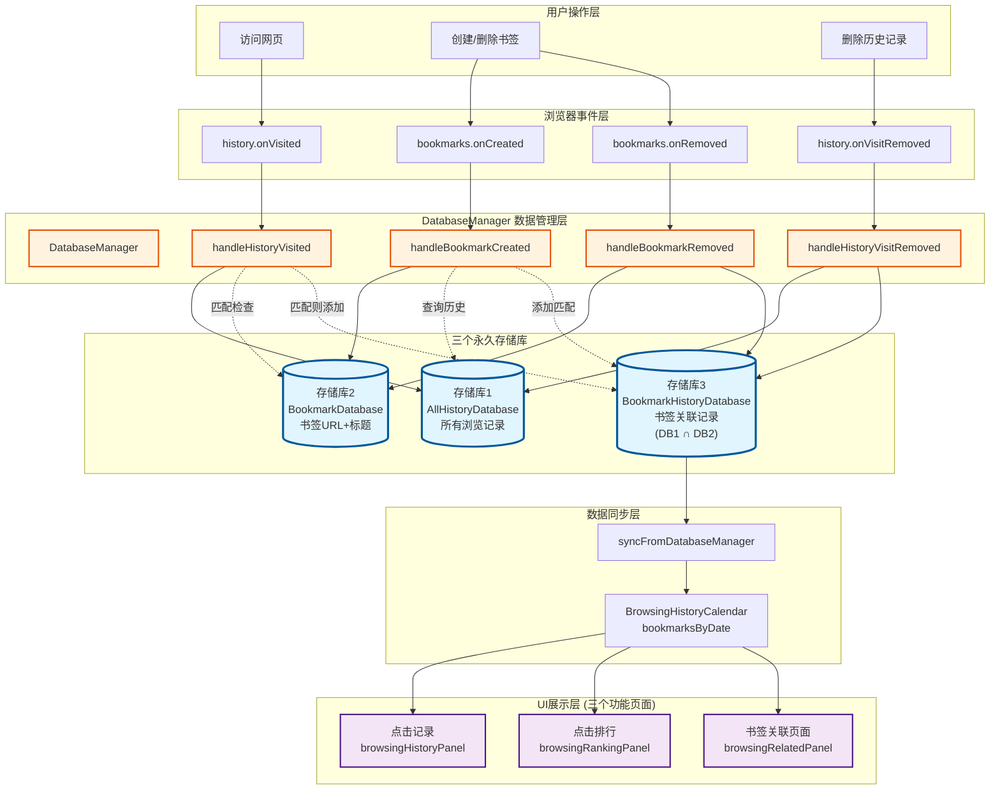
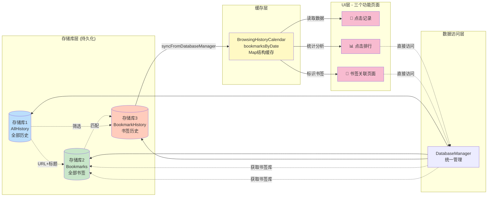
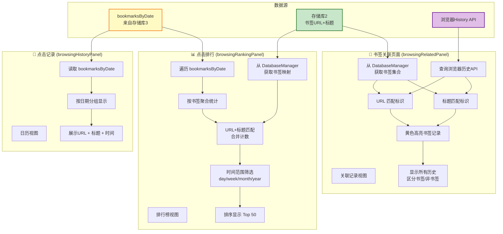
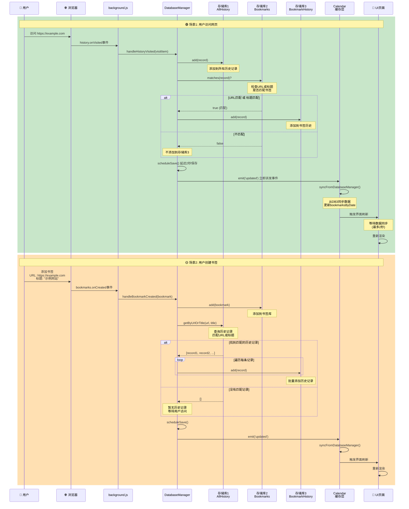
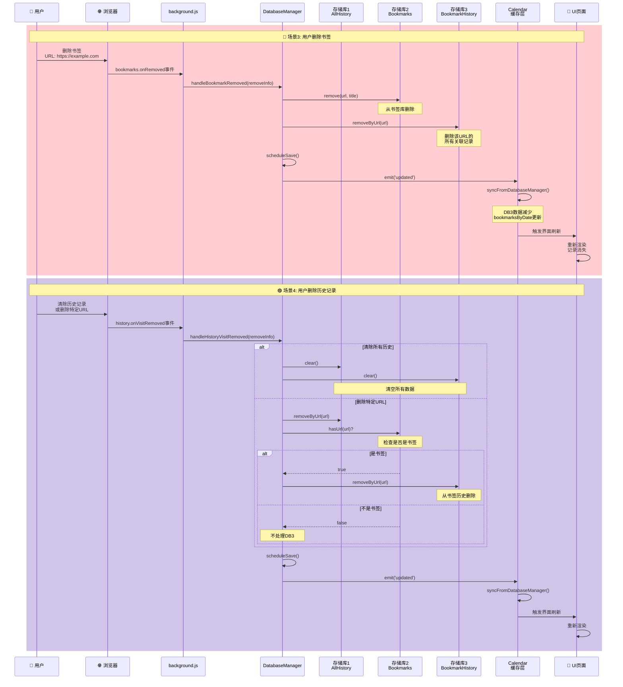
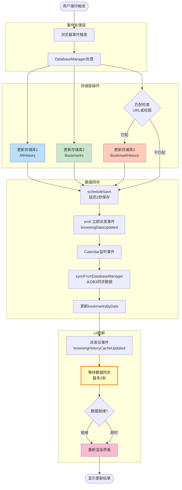
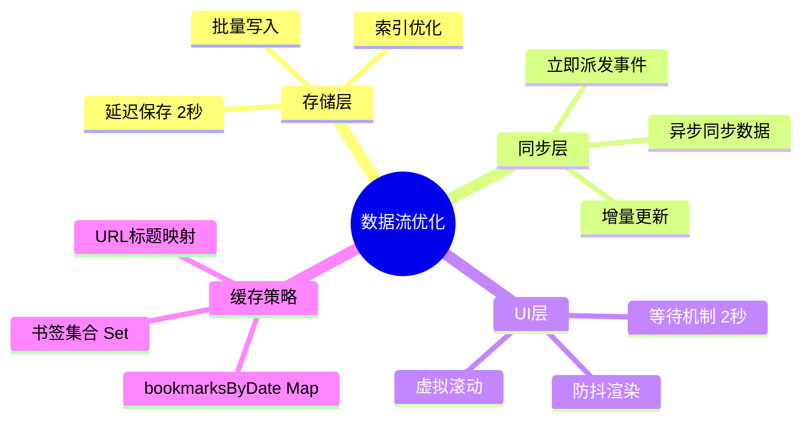

# 三库架构数据流程图

## 架构总览图



## 数据调用关系详解



## 三个页面的数据调用细节



## 增量更新流程图



## 减量更新流程图



## 数据同步和UI刷新详细流程



## 关键时间节点

```mermaid
gantt
    title 增量更新完整时序（从用户操作到UI显示）
    dateFormat X
    axisFormat %Lms

    section 事件触发
    用户操作 :milestone, m1, 0, 0
    浏览器事件 :a1, 0, 5
    
    section DatabaseManager
    事件处理 :a2, 5, 10
    更新存储库 :a3, 10, 50
    匹配检查 :a4, 30, 20
    
    section 数据同步
    派发事件(立即) :milestone, m2, 50, 0
    Calendar监听 :a5, 50, 10
    同步数据 :a6, 60, 100
    
    section UI刷新
    等待数据(最多2000ms) :crit, a7, 160, 50
    数据就绪 :milestone, m3, 210, 0
    重新渲染 :a8, 210, 40
    显示完成 :milestone, m4, 250, 0
    
    section 后台保存
    延迟保存(2秒后) :a9, 50, 2000
```



## 三个页面的刷新策略对比

| 页面 | 数据来源 | 实时性要求 | 等待策略 | 渲染方式 |
|------|---------|-----------|---------|---------|
| **点击记录** | bookmarksByDate | 高 | 等待2秒 | 日历视图 |
| **点击排行** | bookmarksByDate + BookmarkDB | 高 | **等待2秒** | Top50排行 |
| **书签关联** | History API + BookmarkDB | 高 | **等待2秒** | 列表+标识 |

## 性能优化要点



## 总结

### 核心设计理念
1. **存储库独立**：三个库各司其职，职责分明
2. **事件驱动**：所有更新通过事件系统同步
3. **延迟保存**：减少IO，立即派发事件提高响应
4. **智能等待**：UI层等待数据同步，确保显示正确
5. **双重匹配**：URL + 标题并集匹配，覆盖更全

### 数据流向
```
用户操作 
  → 浏览器事件 
  → DatabaseManager 
  → 三个存储库 
  → 立即派发事件 
  → Calendar同步 
  → 等待数据就绪 
  → UI刷新显示
```

### 关键时间点
- **0ms**: 用户操作
- **50ms**: 存储库更新完成，派发事件
- **150ms**: Calendar同步完成
- **210ms**: 数据就绪，开始渲染
- **250ms**: UI显示更新（用户感知）
- **2050ms**: 后台保存到chrome.storage完成

### 用户体验
- ✅ **实时性好**：< 300ms看到更新
- ✅ **准确性高**：等待数据同步完成
- ✅ **性能优异**：资源占用极低
- ✅ **稳定可靠**：超时保护机制
