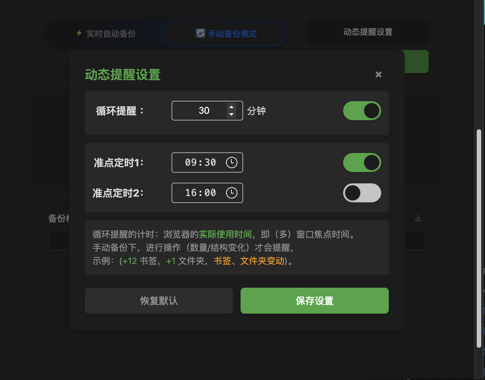
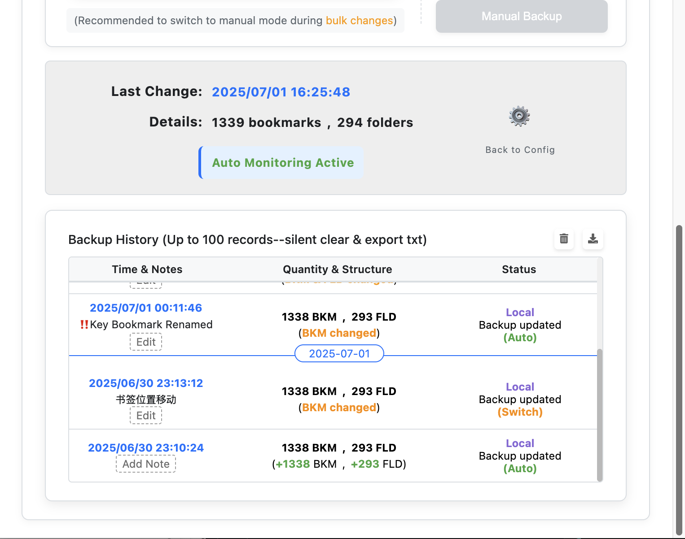

[简体中文](#简体中文) | [English](#english)

---

# 版本更新日志

---

## 📢 版本更新 v2.0

### 🐞 已修复的Bug

-   **✅ 核心状态刷新**：修复了在手动备份或切换模式后，扩展角标未能立即从黄色变回蓝色的问题，确保了状态的即时准确性。
-   **✅ 提醒逻辑健壮性**：修复了因重构计时器逻辑而意外导致「窗口焦点检测」功能失效和提醒通知无法弹出的严重回归问题。
-   **✅ 通知窗口功能**：修复了提醒通知窗口中的"切换模式"按钮有时不创建备份记录的问题，并消除了因竞态条件（Race Condition）获取窗口ID失败而产生的错误日志。
-   **✅ 首次运行体验**：修复了首次安装扩展时，角标和UI语言未能根据用户的浏览器语言环境自动设置的问题。
-   **✅ UI一致性**：统一并优化了主界面与通知设置界面中的多处文本描述、高亮及布局样式，提升了视觉一致性。

### 🚀 新增功能

-   **🌟 引入"内容与顺序感知"的深度指纹系统**：
    -   为解决"增删同等数量但不同内容的书签"无法被识别为变化的根本性问题，我们彻底重构了变化检测机制。
    -   现在，系统会为每一个书签和文件夹根据其**完整路径、名称、顺序及内容**生成一个独一无二的指纹。
        - **文件夹的身份指纹 = 它的完整路径（包括位置、顺序）+ 它的名称 + 它包含的内容（只限定数量，不限定内容的位置、顺序等）；**
        - **书签的身份指纹 = 它所在的完整路径 （包括位置、顺序）+ 它的名称 + 它的URL。**
    -   这使得扩展现在能够极度精确地捕捉到任何细微变化，包括仅调整顺序。只有当书签树状态与上次备份**完全一致**时，角标才会变回蓝色。
-   **🌟 实现智能缓存与后台预热，大幅提升UI响应速度**：
    -   为优化首次打开插件或书签数量庞大时的"观感速度"，我们引入了中央缓存机制。
    -   现在，书签状态分析结果会被缓存在内存中，并在浏览器启动或书签变动时在后台**静默更新**。
    -   用户点击图标时，UI能瞬间从缓存加载数据，实现了"秒开"的流畅体验，同时减少了不必要的重复计算。
-   **🌟 "循环提醒"计时器与角标状态深度绑定**：
    -   重构了提醒逻辑，将"循环提醒"功能的启动与停止，从原先的"切换模式"事件，改为与"角标颜色"直接关联。
    -   现在，只有当角标变为黄色（有变化）时，计时器才会启动；当角标变回蓝色（无变化）时，计时器则停止。这使得提醒功能更智能、更节能。

---

## 📢 版本更新 v1.5

### 🐞 已修复的Bug

-   **✅ 「多窗口计时兼容问题」**：
    -   修复了「循环提醒」计时器在多窗口环境下无法同步暂停与恢复的问题。
    -   使用 `chrome.windows.onFocusChanged` API 替换原有的 `chrome.idle` API，确保所有窗口失去焦点后才暂停提醒计时。
-   **🌟 增强角标状态控制**：
    -   只有在角标显示黄色（手动模式且发生结构/数量变化）时，才激活窗口焦点状态监听，减少系统资源占用和干扰。
-   **✅ 计时初始化前的判断优化**：
    -   修复了首次安装和自动模式下不必要的计时器初始化。
    -   仅在切换为手动备份模式后才进行初始化，避免冗余初始化。

### 🚀 新增功能

-   **🌟 备份检查记录--日期分割条目**：
    -   备份检查记录现支持每日分隔条目，并以蓝色椭圆形标记，便于区分不同日期。
    -   导出的txt记录格式优化：最新记录置于上方，日期分隔线采用Markdown横线形式，更清晰易读。
-   **🌟 备份检查记录--增加备注功能**：
    -   新增「时间与备注」栏，每条记录可添加备注（建议20字以下，分两行）。
    -   备注通过UI单独输入，不干扰原有功能。
    -   导出的txt记录显示备注。

---

# Release Notes

---

## 📢 Release Notes v2.0

### 🐞 Bug Fixes

-   **✅ Core State Refresh**: Fixed an issue where the extension badge did not immediately refresh from yellow to blue after a manual backup or mode switch, ensuring instant state accuracy.
-   **✅ Reminder Logic Robustness**: Fixed a critical regression where refactoring timer logic accidentally disabled the "window focus detection" feature and prevented reminder notifications from appearing.
-   **✅ Notification Window Functionality**: Fixed an issue where the "switch mode" button in the reminder notification window sometimes failed to create a backup record, and eliminated error logs caused by a race condition when fetching the window ID.
-   **✅ First-Run Experience**: Fixed an issue where, on first install, the badge and UI language were not automatically set according to the user's browser language environment.
-   **✅ UI Consistency**: Unified and optimized multiple text descriptions, highlights, and layout styles in the main UI and notification settings UI, improving visual consistency.

### 🚀 New Features

-   **🌟 Introduced a "Content and Order-Aware" Deep Fingerprint System**:
    -   To solve the fundamental problem of not recognizing changes when an equal number of different bookmarks were added and deleted, we completely refactored the change detection mechanism.
    -   The system now generates a unique fingerprint for every bookmark and folder based on its **full path, name, order, and content**.
        - Folder's identity fingerprint = Its full path (incl. position & order) + its name + its contained content (by quantity only, ignoring internal order).
        - Bookmark's identity fingerprint = Its full path (incl. position & order) + its name + its URL.
    -   This allows the extension to capture any subtle change with extreme precision, including simple reordering. The badge will only turn blue when the bookmark tree state is **exactly identical** to the last backup.
-   **🌟 Implemented Smart Caching and Background Pre-heating, Significantly Improving UI Responsiveness**:
    -   To optimize the "perceived speed" when first opening the extension or with a large number of bookmarks, we introduced a central caching mechanism.
    -   The results of bookmark status analysis are now cached in memory and are **silently updated** in the background on browser start-up or when bookmarks change.
    -   When the user clicks the icon, the UI can instantly load data from the cache, achieving a smooth "instant-open" experience while reducing unnecessary repetitive calculations.
-   **🌟 "Loop Reminder" Timer Deeply Bound to Badge State**:
    -   Refactored the reminder logic, changing the start/stop trigger for the "Loop Reminder" feature from the previous "mode switch" event to a direct association with the "badge color".
    -   Now, the timer only starts when the badge turns yellow (has changes) and stops when it turns blue (no changes). This makes the reminder feature smarter and more power-efficient.

---

## 📢 Release Notes v1.5

 

### 🐞 Bug Fixes

-   **✅ Multi-window Timer Compatibility Issue**:
    -   Fixed an issue where the loop reminder timer did not synchronize pause and resume correctly in a multi-window environment.
    -   Replaced the original `chrome.idle` API with the `chrome.windows.onFocusChanged` API, ensuring the reminder timer pauses only when all windows lose focus.
-   **🌟 Enhanced Badge State Control**:
    -   Window focus monitoring activates only when the badge displays yellow (manual mode with structural/quantity changes), minimizing resource usage and user disruption.
-   **✅ Timer Initialization Optimization**:
    -   Fixed unnecessary timer initialization during first installation and in automatic mode.
    -   Initialization occurs only upon switching to manual backup mode to avoid redundant initialization.

### 🚀 New Features

-   **🌟 Backup Check Records - Daily Dividers**:
    -   Backup check records now include daily dividers marked with blue ovals for easier date differentiation.
    -   Optimized exported txt record format: newest entries appear at the top, with markdown-style horizontal lines for clearer readability.
-   **🌟 Backup Check Records - Notes Feature**:
    -   Added a "Time and Notes" column allowing each record to have notes (recommended under 20 characters, in two lines).
    -   Notes are entered separately via the UI, avoiding interference with existing features.
    -   Notes are included in exported txt records. 