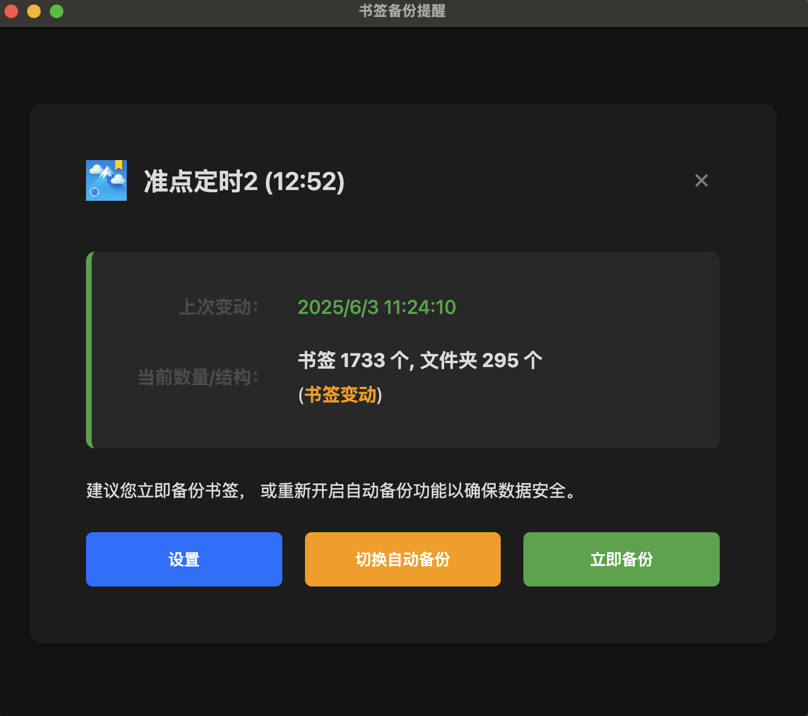
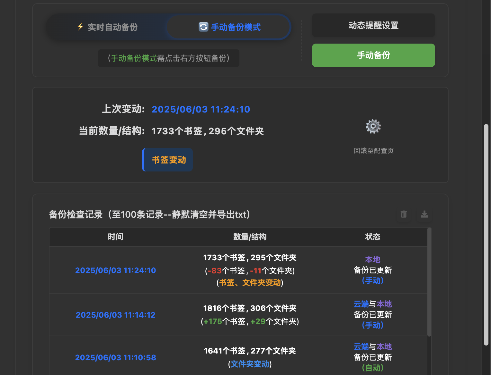
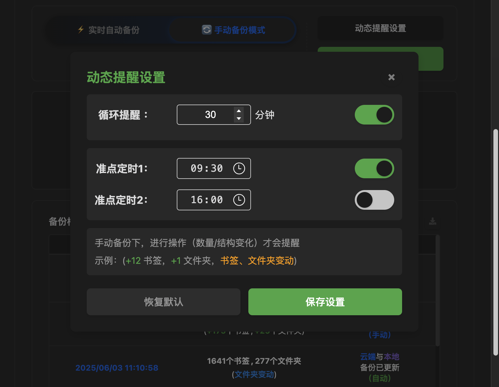

# 书签备份 Bookmark-Backup
[简体中文] | [English](#english-version)

---

# 书签备份

## 项目概述

书签备份是一款 Chrome/Edge 浏览器扩展程序，旨在提供强大且灵活的书签备份功能。它通过多种备份选项（云端/本地、自动/手动）、完善的手动备份提醒系统、不覆盖时间线式备份体系、智能的活动状态检测和崩溃恢复机制，确保您宝贵的书签数据安全无忧。

## 图片示例
<table>
  <tr>
    <td></td>
    <td></td>
  </tr>
  <tr>
    <td></td>
    <td></td>
  </tr>
</table>

## 安装指南

1.  **从 Chrome 应用商店 / Edge 加载项商店安装：**
    *   [Edge 加载项商店](https://microsoftedge.microsoft.com/addons/detail/%E4%B9%A6%E7%AD%BE%E5%A4%87%E4%BB%BDbookmark-backup/klopopehpngheikchkjgkmplgmbfodek)
    *   [Chrome 应用商店](https://chromewebstore.google.com/detail/%E4%B9%A6%E7%AD%BE%E5%A4%87%E4%BB%BD-bookmark-backup/dbdpgedioldmeooemjanbjlhgpocafbc)
2.  **手动安装（开发者模式）：**
    *   从 [GitHub Releases](https://github.com/kwenxu/Bookmark-Backup/releases) 下载nolog生产版本。
    *   打开 Chrome/Edge 浏览器，导航至 `chrome://extensions` 或 `edge://extensions`。
    *   启用"开发者模式"。
    *   点击"加载已解压的扩展程序"，然后选择 `BookmarkBackup_nolog_vx.xx` 目录（或扩展程序的根目录）。

## 重要提示
*   确保您的 WebDAV 服务器详细信息正确且互联网连接稳定，以成功进行云备份。
*   曲线云端备份：本地备份时，修改浏览器默认下载路径至云盘处（或进行路径关联）。

*   在执行大规模书签操作（导入、导出、大量重组）时，建议暂时禁用"实时自动备份"。
*   手动备份模式下将默认启动**备份提醒系统**，进行书签操作（数量/结构变化）时才会提醒。
    数量/结构变化示例：(+12 书签，+1 文件夹，**书签、文件夹变动**)。

*   备份的书签数据，显示的文件夹数量比实际的少1个，这是因为根文件夹在界面上不可见，但在API计数中会被统计。

---

## 贡献代码

欢迎提交 问题 (issues) 和功能请求 (feature requests)！请随时查看 [问题页面](https://github.com/kwenxu/Bookmark-Backup/issues)。

## 开源许可

（[LICENSE](LICENSE)。如果您在选择方面需要帮助，请访问 [https://choosealicense.com/](https://choosealicense.com/)）

---

## 功能特性

*   **备份目的地：**
    *   **云端备份：** 安全地将您的书签备份到您首选的支持 WebDAV 的云存储服务（例如：坚果云、Nextcloud）。
    *   **本地备份：** 将您的书签以 HTML 文件形式保存到浏览器默认的本地下载路径（可更改）。

*   **灵活的备份模式：**
    *   **实时自动备份：** 当检测到书签发生更改（添加、删除、修改、移动）时，扩展程序会自动备份您的书签。在进行大规模书签整理时，建议暂时禁用此功能，以避免不必要的频繁备份。
    *   **手动备份：** 手动备份模式下将默认启动**备份提醒系统**，当进行书签操作（数量/结构变化）时才会提醒。
    数量/结构变化示例：(+12 书签，+1 文件夹，**书签、文件夹变动**)。

*   **备份提醒系统（手动备份模式下）：**
    *   **智能激活与提醒：** 仅在用户切换到手动备份模式后启动。提醒会结合书签活动状态——当检测到书签发生实际变动（增、删、改、移动）后（此时角标为黄色），才会发出提醒。
    *   **深度逻辑重构：** "循环提醒"的计时器与角标状态深度绑定。现在，只有当角标因书签变化变为黄色时，计时器才会启动；当角标恢复蓝色时则自动停止。这使得提醒更智能、更节能。
    *   **暂停与恢复：** 采用 `chrome.windows.onFocusChanged` API 智能检测用户是否正在使用浏览器。只有当所有浏览器窗口都失去焦点时（例如，用户切换到其他应用程序），提醒计时器才会暂停，并在用户返回时恢复。
    *   **崩溃恢复能力：** 利用 `chrome.alarms` API 的持久性，即使浏览器意外关闭或崩溃，在重启后提醒计时器将会重置初始化。
    *   **提醒类型与配置：**
        *   **循环提醒：** 默认30分钟进行检测提醒。
        *   **准点定时提醒：** 固定的时间点（例如上午9:30，下午17:00）进行备份提醒，每日零点后5秒会补充进行日期变更检查。
    *   **快捷备份按钮：** 弹出的提醒窗口的三个按钮可以进行设置、切换、备份。

*   **备份历史与时间线：** 扩展程序会详细记录每一次备份操作，并提供功能丰富的历史记录界面。
    *   **备注功能：** 新增"时间与备注"栏，每条记录均可添加备注（建议20字以内）。备注会显示在历史记录中，并包含在导出的历史文件中。
    *   **日期分隔：** 为了便于追溯，历史记录在界面上按天分隔，并以蓝色标签高亮显示日期。导出的 `.txt` 文件也包含Markdown格式的日期分隔线。
    *   **优化导出：** 导出的历史记录中，最新记录会置于顶部，方便查阅。
    *   **自动归档：** 历史记录达到100条时会自动清除并导出，防止无限增长。

*   **扩展程序图标角标：**
    *   在自动备份模式下显示"自"（中文）或"A"（英文），默认为绿色，备份时角标闪烁。
    *   在手动备份模式下显示"手"（中文）或"M"（英文），默认为蓝色，若数量/结构变化，角标背景将变为黄色以作提示。
*   **书签与文件夹数量显示：** 弹出界面会显示当前书签和文件夹的数量。
*   **上次变动：** 显示上次成功备份的时间和状态。
*   **主题支持：** 包括浅色和深色模式主题，默认跟随浏览器主题。

*   **内容与顺序感知的深度变化检测：** 引入了基于内容与顺序的"深度指纹"系统，以取代原有的简单数量对比。系统会为每个书签和文件夹根据其**完整路径、名称、顺序及内容**生成独一无二的指纹。这使得扩展能够极其精确地捕捉任何细微变化，包括仅调整顺序或增删同等数量但不同内容的书签。只有当书签树状态与上次备份**完全一致**时，角标才会恢复为蓝色，确保了状态的绝对准确性。

*   **智能缓存与UI性能优化：** 为优化首次打开或书签数量庞大时的响应速度，引入了中央缓存机制。书签状态分析结果（如是否有变动）会在浏览器启动或书签变动时在后台**静默预热**并缓存。用户点击图标时，UI能瞬间从缓存加载数据，实现了"秒开"的流畅体验。

---

## 技术细节

*   **核心API利用：**
    *   `chrome.bookmarks`: 用于管理书签的创建、读取、修改和删除。
    *   `chrome.storage.local`: 用于在用户本地存储扩展程序的设置、状态信息和备份历史。
    *   `chrome.runtime`: 用于处理扩展程序的生命周期事件（如安装、更新）、消息传递以及获取运行时环境信息。
    *   `chrome.alarms`: 用于创建和管理定时任务，例如定期自动备份和提醒调度。
    *   `chrome.notifications` 及 `chrome.windows.create`: 用于向用户显示通知（如备份状态），以及创建提醒相关的窗口界面。
    *   `chrome.downloads` & `chrome.downloads.shelf`: 用于管理本地备份文件下载并可选择隐藏下载栏。
    *   `Fetch API`: 用于执行与 WebDAV 服务器的网络请求，实现云端备份和历史记录导出（通过 `host_permissions` 声明了对任意 HTTPS 域的访问权限，以支持用户配置的 WebDAV 服务器）。
    *   `chrome.windows.onFocusChanged`: 用于检测浏览器窗口的焦点变化。当所有窗口都失去焦点时，扩展程序会暂停提醒计时器，并在任何窗口重新获得焦点时恢复，从而更精确地判断用户是否正在与浏览器交互。
    *   `chrome.tabs`: 辅助获取标签页信息，支持窗口间的定位与通信，例如在创建或管理通知窗口时确定其上下文。

*   **文件结构概述**
    *   `manifest.json`: 定义扩展程序的元数据、权限、后台脚本、弹出页面、图标等核心配置。此扩展遵循 Manifest V3规范。
    *   `background.js`: 处理所有后台逻辑，包括备份过程（将书签上传至WebDAV及保存到本地）、与备份输出相关的同步协调、状态管理（如**基于指纹的深度书签变更检测**、操作状态）、事件监听（如书签活动、定时任务、下载事件）、提醒调度、动态角标管理、**管理UI缓存与初始语言检测**、下载防打扰功能以及与弹出窗口的全面消息通信。
    *   `popup.js`: 构建和管理用户界面，包括 WebDAV 的配置面板、本地自动备份的控制开关、状态显示（同步历史、书签统计、备份模式）、操作按钮和提醒设置；处理所有用户交互（包括界面主题的加载、应用和用户偏好保存），并将用户操作通过消息传递给 `background.js` 执行；**通过读取后台缓存数据实现UI"秒开"**；通过自定义的字符串管理机制实现国际化支持，可动态更新界面语言；并与 `background.js` 进行双向通信以更新UI和发送指令。
    *   `popup.html`: 定义了扩展程序弹出窗口的全部UI元素结构，包括各个配置区域、信息显示面板和交互按钮。
    *   `theme.js`: 可能包含与界面主题相关的辅助工具或特定组件的样式逻辑。主弹出窗口的主题切换和偏好管理由 `popup.js` 处理。
    *   `backup_reminder/` 目录: 包含备份提醒功能特有的模块。主要包括：
        *   `index.js`: 作为备份提醒系统的核心中央协调器，全面负责管理提醒的整体生命周期和状态（例如，当前活动的通知窗口ID、用户对通知的交互状态、计时器是否因设置UI暂停等）。它不仅集成并调用 `timer.js`（处理所有计时逻辑）和 `notification.js`（处理通知窗口的创建与管理）的功能，还包含了健壮的初始化逻辑以防止重复执行。此模块主动响应浏览器窗口的焦点变化 (`chrome.windows.onFocusChanged`) 来智能地暂停或恢复提醒计时器，并作为消息中枢处理与扩展其他部分（如 `background.js` 进行模式切换通信，或与 `popup.js` 及通知窗口自身进行配置更新、状态查询和用户操作指令）的复杂消息通信。
        *   `timer.js`: 此文件是备份提醒系统的核心计时引擎。它完全依赖 `chrome.alarms` API 来管理所有类型的提醒，包括用户可配置的循环提醒和两个独立的准点定时提醒，确保了即使在浏览器关闭后这些提醒也能持久化。它负责精确控制计时器的启动、停止、暂停（例如响应浏览器闲置状态）和恢复，并详细跟踪提醒的当前阶段、已用时间、是否已显示等状态（状态持久化于 `storage.local`）。此模块还包含了每日日期变更检查逻辑，以重置提醒状态或重新安排准点定时，并与 `index.js` 紧密协作以在适当的时候触发通知显示。其内部实现了复杂的逻辑来计算下一次提醒的准确时间和处理各种边缘情况，例如从浏览器非活动状态恢复时检查错过的准点提醒。
        *   `notification.js`: 作为通知显示的直接管理者，此模块使用 `chrome.windows.create` API 来创建和管理提醒通知窗口的生命周期。它主要负责展示由 `notification_popup.html` 定义的交互式HTML通知窗口，但也能够显示一个更简单的 `notification.html` 用于测试或强制提醒。模块会向通知窗口传递必要的参数（如提醒类型、书签变化描述、当前语言等），并管理通知窗口的自动关闭机制（例如20秒后自动关闭，除非用户正在交互）。当通知窗口关闭后（无论是由用户操作、自动关闭还是其他方式），`notification.js` 会与 `timer.js` 协调，以启动下一个提醒周期或重置相应的准点闹钟。
        *   `notification_theme.js`: 此脚本在 `notification_popup.html` 的 `<head>` 中提前加载，主要职责是尽早应用用户选择的主题（浅色/深色/系统默认）。它通过读取存储的偏好并检测系统设置，为 `<html>` 根元素设置 `data-theme` 属性，从而激活 `notification_popup.html` 中定义的相应CSS变量，有效避免了内容加载时的主题闪烁问题。
        *   `notification_popup.html`: 定义了主备份提醒通知窗口的完整UI结构。其界面不仅展示了备份提醒信息（如上次备份时间、当前书签数量和具体变动描述），还提供了直接的操作按钮（"设置"、"切换自动备份"、"立即备份"）。一个显著的特点是，它内嵌了一个功能完善的模态对话框，用于让用户详细配置手动备份的循环提醒和准点定时参数。此HTML文件大量使用CSS变量进行主题化（浅色/深色模式），并依赖 `notification_theme.js` 进行早期主题应用，以及 `notification_popup.js` 来实现所有交互逻辑和动态内容。
        *   `notification_popup.js`: 这是 `notification_popup.html` 页面的主要交互逻辑脚本。它负责初始化窗口，包括根据URL参数（由 `notification.js` 传递）和从后台脚本获取的动态数据（如备份统计、当前语言设置）填充界面内容。此脚本处理窗口内所有用户操作的事件监听，例如点击主操作按钮、打开和关闭内嵌的提醒设置模态框、以及在设置模态框内修改配置并保存。它通过直接操作DOM元素的文本内容来实现全面的国际化，并与后台脚本（主要是 `index.js` 和 `background.js`）进行频繁的双向消息通信，以发送用户指令、请求数据或状态，以及响应后台事件。
        *   `settings.html`: 提供了详细的手动备份提醒设置界面，允许用户配置循环提醒的各阶段时长、启用/禁用特定的准点定时提醒并设定其时间。相关逻辑主要由 `popup.js` 或 `backup_reminder/index.js` 通过消息传递驱动 `backup_reminder/notification_popup.js` 内的设置组件实现。
    *   `icons/` 目录: 包含扩展程序在浏览器界面（如工具栏、扩展管理页面）中显示的各种尺寸图标。

---

## 两处妥协

### 一、 **本地备份策略与浏览器限制的平衡**

此扩展为实现自动、静默的本地书签备份，采用了依赖浏览器"默认下载文件夹"的策略。这是在当前浏览器安全限制下，为确保插件核心功能所做的必要平衡。

**1.  本地备份机制解析：**
*   **浏览器安全为先**：Chrome扩展出于安全考量，无法直接、静默地向用户指定的任意本地路径写入文件。
*   **静默下载的实现**：通过 `chrome.downloads.download()` 并设置 `saveAs: false` 实现自动下载，文件将固定保存到浏览器默认下载位置。
*   **备份至 `Bookmarks` 子目录**：扩展利用 `filename: 'Bookmarks/backup.html'`，在默认下载文件夹内创建或使用 `Bookmarks` 子目录存放备份。
*   **用户路径认知**：用户需关注其实际的浏览器默认下载设置。

**2.  用户策略："曲线"实现云端备份**
鉴于上述机制，用户可通过以下策略，将本地备份间接同步至云端：
*   **核心思路**：将浏览器的"默认下载文件夹"直接设置为云盘（如Google Drive, OneDrive, Dropbox等）的本地同步目录，或该同步目录下的 `Bookmarks` 子目录。
*   **高级技巧**：或在实际的默认下载路径中，针对 `Bookmarks` 文件夹使用符号链接 (Symbolic Links) 或特定云盘的文件夹同步功能，将其"挂载"到云盘。
*   **(示例) 特定操作系统用户**：如macOS用户可考虑将默认下载路径设为已启用iCloud同步的"文稿"或"桌面"文件夹内的子目录。
这种"下载到默认位置，再由用户策略性地使其同步到云端"的模式，是扩展在浏览器限制下，达成自动本地备份并辅助用户实现云备份目标的实用方案。

### 二、 **书签导出机制说明**
本插件提供书签导出功能，允许您将 Chrome 书签备份到本地 HTML 文件。理解其工作原理和与浏览器原生导出的差异非常重要：
**书签备份数据的导出方法：**
1.  **数据获取**: 插件**只能**通过 Chrome 提供的 `chrome.bookmarks` API 读取书签**核心信息**，如名称、URL、文件夹ID、位置信息。
    * **限制**: 与 Chrome 原生导出相比，本插件导出的文件在数据完整性上有所区别：
        * **缺失 Favicon**: 书签的网站图标会丢失，导入后显示通用图标，点击后刷新（文件数据量减少）。
        * **部分排序信息缺失**:\
            * Chrome 浏览器书签侧边栏："上次打开时间"将不可用（其依赖新浏览器内部的排序依据），而"从新到旧"、"从旧到新"、"由A到Z"等功能仍可使用（Edge浏览器暂无此类功能）。
            * **不过**，书签、文件夹的**位置改动**（即结构变化）会定格记录并导出至 HTML 中。
        * **特定属性缺失**: 无法包含 Chrome 内部用于结构识别的特定属性（如 `PERSONAL_TOOLBAR_FOLDER`），但这通常不影响基本功能，浏览器导入时可智能识别。
2.  **文件生成**: 插件会自行将这些有限的 JSON 格式数据格式化并生成标准的 Netscape Bookmark File Format (HTML) 字符串。
3.  **文件输出**: 生成的 HTML 字符串将提供给用户下载为类似 `20250601_184425.html` 的备份文件。

---

# Bookmark Backup

## Overview

Bookmark Backup & Reminder is a Chrome/Edge browser extension designed to provide robust and flexible bookmark backup functionality. It ensures your valuable bookmark data is safe through multiple backup options (cloud/local, automatic/manual), a comprehensive manual backup reminder system, a non-overwrite timeline-based backup system, intelligent activity state detection, and crash recovery mechanisms.

## Image Examples
<table>
  <tr>
    <td></td>
    <td></td>
  </tr>
  <tr>
    <td></td>
    <td></td>
  </tr>
</table>

## Installation Guide

1.  **Install from Chrome Web Store / Edge Add-ons Store:**
    *   **Edge:** Available on [Microsoft Edge Add-ons](https://microsoftedge.microsoft.com/addons/detail/%E4%B9%A6%E7%AD%BE%E5%A4%87%E4%BB%BDbookmark-backup/klopopehpngheikchkjgkmplgmbfodek).
    *   **Chrome:** [Chrome Web Store](https://chromewebstore.google.com/detail/%E4%B9%A6%E7%AD%BE%E5%A4%87%E4%BB%BD-bookmark-backup/dbdpgedioldmeooemjanbjlhgpocafbc).
2.  **Manual Installation (Developer Mode):**
    *   Download the nolog production version from [GitHub Releases](https://github.com/kwenxu/Bookmark-Backup/releases).
    *   Open Chrome/Edge browser, navigate to `chrome://extensions` or `edge://extensions`.
    *   Enable "Developer Mode".
    *   Click "Load unpacked" and select the `BookmarkBackup_nolog_vx.xx` directory (or the extension\'s root directory).

## Important Notes
*   Ensure your WebDAV server details are correct and your internet connection is stable for successful cloud backups.
*   Workaround for cloud backup: When performing local backups, change the browser\'s default download path to your cloud drive\'s synchronized folder (or link the paths).
*   When performing large-scale bookmark operations (importing, exporting, extensive reorganization), it is recommended to temporarily disable "Real-time Automatic Backup".
*   In manual backup mode, the **Backup Reminder System** will be activated by default and will only remind you when bookmark operations (changes in quantity/structure) occur.
    Example of quantity/structure changes: (+12 bookmarks, +1 folder, **bookmark/folder changes**).
*   The number of folders displayed in the backed-up bookmark data is one less than the actual count. This is because the root folder is not visible in the UI but is counted by the API.

---

## Contributing

Contributions, issues, and feature requests are welcome! Please feel free to check the [issues page](https://github.com/kwenxu/Bookmark-Backup/issues).

## License

([LICENSE](LICENSE). If you need help choosing, visit [https://choosealicense.com/](https://choosealicense.com/))

---

## Features

*   **Backup Destinations:**
    *   **Cloud Backup:** Securely back up your bookmarks to your preferred WebDAV-enabled cloud storage service (e.g., Nutstore, Nextcloud).
    *   **Local Backup:** Save your bookmarks as an HTML file to the browser\'s default local download path (changeable).

*   **Flexible Backup Modes:**
    *   **Real-time Automatic Backup:** When changes to bookmarks (add, delete, modify, move) are detected, the extension automatically backs up your bookmarks. It is recommended to temporarily disable this feature during large-scale bookmark organization to avoid unnecessary frequent backups.
    *   **Manual Backup:** In manual backup mode, the **Backup Reminder System** is activated by default. It will only issue a reminder when bookmark operations (changes in quantity/structure) occur.
    Example of quantity/structure changes: (+12 bookmarks, +1 folder, **bookmark/folder changes**).

*   **Backup Reminder System (in Manual Backup Mode):**
    *   **Smart Activation & Reminders:** Activates only when the user switches to manual backup mode. Reminders are combined with bookmark activity status—a reminder is issued only after actual changes to bookmarks (add, delete, modify, move) are detected (badge turns yellow at this point).
    *   **Deep Logic Refactoring:** The "Cyclical Reminder" timer is now deeply bound to the badge state. The timer only starts when the badge turns yellow due to bookmark changes and automatically stops when it reverts to blue. This makes the reminder smarter and more power-efficient.
    *   **Pause & Resume:** Uses the `chrome.windows.onFocusChanged` API to intelligently detect if the user is interacting with the browser. The reminder timer will only pause when all browser windows lose focus (e.g., when the user switches to another application) and will resume upon return.
    *   **Crash Recovery Capability:** Utilizes the persistence of the `chrome.alarms` API. Even if the browser closes unexpectedly or crashes, the reminder timer will be re-initialized upon restart.
    *   **Reminder Types & Configuration:**
        *   **Cyclical Reminders:** By default, checks for reminders every 30 minutes.
        *   **Fixed-Time Reminders:** Reminders at fixed times (e.g., 9:30 AM, 5:00 PM). A date change check is performed 5 seconds after midnight daily.
    *   **Quick Backup Buttons:** The three buttons in the reminder popup window allow for settings, mode switching, and backup.

*   **Backup History & Timeline:** The extension meticulously records every backup operation and provides a feature-rich history interface.
    *   **Notes Feature:** A new "Time & Notes" column allows you to add a short note to each record (under 20 characters recommended). Notes are displayed in the history and included in the exported file.
    *   **Date Separators:** To make tracking easier, the history is visually separated by day with a blue tag. The exported `.txt` file also includes Markdown-style date separators.
    *   **Optimized Export:** In the exported history, the newest records are placed at the top for convenient reviewing.
    *   **Auto-Archiving:** The history is automatically cleared and exported upon reaching 100 entries to manage its size.

*   **Extension Icon Badge:**
    *   Displays "自" (Chinese) or "A" (English) in automatic backup mode, green by default, flashes during backup.
    *   Displays "手" (Chinese) or "M" (English) in manual backup mode, blue by default. If quantity/structure changes, the badge background turns yellow as a prompt.
*   **Bookmark & Folder Count Display:** The popup interface shows the current number of bookmarks and folders.
*   **Last Change:** Displays the time and status of the last successful backup.
*   **Theme Support:** Includes light and dark mode themes. User-set themes are saved; if no user setting is present, a default theme is applied (typically light).

*   **Deep Change Detection with Content & Order Awareness:** Introduced a "deep fingerprint" system based on content and order to replace the previous simple count comparison. The system generates a unique fingerprint for every bookmark and folder based on its **full path, name, order, and content**. This allows the extension to capture any subtle change with extreme precision, including simple reordering or adding/deleting an equal number of different bookmarks. The badge will only revert to blue when the bookmark tree state is **exactly identical** to the last backup, ensuring absolute state accuracy.

*   **Smart Caching & UI Performance Optimization:** To optimize responsiveness when first opening the extension or with a large number of bookmarks, a central caching mechanism has been introduced. The results of bookmark status analysis (e.g., whether there are changes) are **silently pre-heated** and cached in the background on browser start-up or when bookmarks change. When the user clicks the icon, the UI can instantly load data from the cache, achieving a smooth "instant-open" experience.

---

## Technical Details

*   **Core API Usage:**
    *   `chrome.bookmarks`: Used for managing bookmark creation, reading, modification, and deletion.
    *   `chrome.storage.local`: Used to store extension settings, status information, and backup history locally on the user\'s device.
    *   `chrome.runtime`: Used for handling extension lifecycle events (e.g., installation, updates), message passing, and obtaining runtime environment information.
    *   `chrome.alarms`: Used for creating and managing scheduled tasks, primarily for the backup reminder system's reminder scheduling (automatic backups are currently triggered mainly by real-time bookmark changes).
    *   `chrome.notifications` & `chrome.windows.create`: Used to display notifications to the user (e.g., backup status) and create reminder-related window interfaces.
    *   `chrome.downloads` & `chrome.downloads.shelf`: Used for managing local backup file downloads and optionally hiding the download shelf.
    *   `Fetch API`: Used for executing network requests with WebDAV servers, enabling cloud backup and history export (declares access to any HTTPS domain via `host_permissions` to support user-configured WebDAV servers).
    *   `chrome.windows.onFocusChanged`: Used to detect focus changes in browser windows. The extension pauses the reminder timer when all windows lose focus and resumes it when any window regains focus, providing a more accurate way to determine user interaction.
    *   `chrome.tabs`: Assists in obtaining tab information, supporting inter-window positioning and communication, such as determining context when creating or managing notification windows.

*   **File Structure Overview**
    *   `manifest.json`: Defines the extension\'s metadata, permissions, background scripts, popup page, icons, and other core configurations. This extension follows the Manifest V3 specification.
    *   `background.js`: Handles all background logic, including the backup process (uploading bookmarks to WebDAV and saving locally), coordination of backup output, state management (e.g., **deep bookmark change detection based on fingerprints**, operational states), event listening (e.g., bookmark activity, alarms, download events), reminder scheduling, dynamic badge management, **managing the UI cache and initial language detection**, download anti-disturbance features, and comprehensive message communication with the popup window.
    *   `popup.js`: Builds and manages the user interface, including the configuration panel for WebDAV, controls for local automatic backup, status displays (sync history, bookmark statistics, backup mode), action buttons, and reminder settings; handles all user interactions (including loading, applying, and saving user preferences for interface themes) and passes user actions via messages to `background.js` for execution; **achieves an "instant-open" UI by reading cached data from the background**; implements internationalization using a custom string management system, dynamically updating UI language; and communicates bidirectionally with `background.js` to update the UI and send commands.
    *   `popup.html`: Defines the entire UI element structure for the extension's popup window, including various configuration areas, information display panels, and interactive buttons.
    *   `theme.js`: May contain auxiliary tools or styling logic for specific components related to interface themes. The main popup window's theme switching and preference management are handled by `popup.js`.
    *   `backup_reminder/` directory: Contains modules specific to the backup reminder functionality. It mainly includes:
        *   `index.js`: Serves as the central coordinator for the backup reminder system, comprehensively managing the overall lifecycle and state of reminders (e.g., current active notification window ID, user interaction status with notifications, whether timers are paused by the settings UI). It not only integrates and calls functions from `timer.js` (handling all timing logic) and `notification.js` (handling creation and management of notification windows) but also includes robust initialization logic to prevent duplicate executions. This module proactively responds to browser window focus changes (`chrome.windows.onFocusChanged`) to intelligently pause or resume reminder timers and acts as a message hub for complex communications with other parts of the extension, such as mode switching with `background.js`, or configuration updates, status queries, and user action commands with `popup.js` and the notification windows themselves.
        *   `timer.js`: This file is the core timing engine of the backup reminder system. It exclusively relies on the `chrome.alarms` API to manage all types of reminders, including user-configurable cyclic reminders and two independent fixed-time reminders, ensuring persistence even after browser closure. It precisely controls the starting, stopping, pausing (e.g., in response to browser idle state), and resuming of timers, and meticulously tracks the current reminder phase, elapsed time, and whether a reminder has been shown (with state persisted to `storage.local`). The module also incorporates logic for daily date change checks to reset reminder states or reschedule fixed-time alarms, and works closely with `index.js` to trigger notification displays at appropriate times. Internally, it implements complex logic to calculate accurate next reminder times and handle various edge cases, such as checking for missed fixed-time alarms when the browser recovers from an inactive state.
        *   `notification.js`: As the direct manager of notification displays, this module uses the `chrome.windows.create` API to create and manage the lifecycle of reminder notification windows. It is primarily responsible for displaying the interactive HTML notification window defined by `notification_popup.html`, but can also show a simpler `notification.html` for test or forced reminders. The module passes necessary parameters to the notification window (like reminder type, bookmark change descriptions, current language) and manages an auto-close mechanism for the window (e.g., closing after 20 seconds unless the user is interacting). After a notification window is closed (whether by user action, auto-close, or other means), `notification.js` coordinates with `timer.js` to initiate the next reminder cycle or reset the corresponding fixed-time alarm.
        *   `notification_theme.js`: This script is pre-loaded in the `<head>` of `notification_popup.html`. Its primary responsibility is to apply the user-selected theme (light/dark/system default) as early as possible. It reads stored preferences, detects system settings, and sets a `data-theme` attribute on the `<html>` root element, thereby activating the corresponding CSS variables defined in `notification_popup.html` and effectively preventing theme flickering during content loading.
        *   `notification_popup.html`: Defines the complete UI structure for the main backup reminder notification window. Its interface not only displays reminder information (such as last backup time, current bookmark counts, and specific change descriptions) but also provides direct action buttons ("Settings," "Toggle Auto Backup," "Backup Now"). A notable feature is its embedded, fully functional modal dialog that allows users to configure detailed settings for manual backup's cyclic and fixed-time reminders. This HTML file extensively uses CSS variables for theming (light/dark modes) and relies on `notification_theme.js` for early theme application, and `notification_popup.js` for all interactive logic and dynamic content.
        *   `notification_popup.js`: This is the main interactive logic script for the `notification_popup.html` page. It is responsible for initializing the window, including populating the UI with dynamic data from URL parameters (passed by `notification.js`) and from background scripts (like backup statistics, current language settings). This script handles event listeners for all user actions within the window, such as clicking main action buttons, opening and closing the embedded reminder settings modal, and modifying and saving configurations within that settings modal. It implements comprehensive internationalization by directly manipulating the text content of DOM elements and engages in frequent two-way message communication with background scripts (primarily `index.js` and `background.js`) to send user commands, request data or status, and respond to background events.
        *   `settings.html`: Provides the detailed manual backup reminder settings interface, allowing users to configure durations for various reminder stages, and enable/disable specific fixed-time reminders and set their times. The related logic is primarily driven by `popup.js` or `backup_reminder/index.js` via message passing to components within `backup_reminder/notification_popup.js`.
    *   `icons/` directory: Contains icons of various sizes for the extension\'s display in the browser interface (e.g., toolbar, extension management page).

---

## Two Areas of Compromise

### 1. Local Backup Strategy & Browser Limitations: A Balance

To achieve automatic, silent local bookmark backups, this extension adopts a strategy reliant on the browser\'s "default download folder." This is a necessary balance made to ensure the plugin\'s core functionality under current browser security restrictions.

**I. Local Backup Mechanism Explained:**
*   **Browser Security First**: For security reasons, Chrome extensions cannot directly and silently write files to arbitrary local paths specified by the user.
*   **Achieving Silent Downloads**: Automatic downloads are implemented using `chrome.downloads.download()` with `saveAs: false`, which causes files to be saved to the browser\'s default download location.
*   **Backup to `Bookmarks` Subfolder**: The extension uses `filename: 'Bookmarks/backup.html'` to create or use a `Bookmarks` subfolder within the default download folder for storing backups.
*   **User Path Awareness**: Users need to pay attention to their actual browser default download settings.

**II. User Strategies: "Workaround" for Cloud Synchronization**
Given the mechanism above, users can employ the following strategies to indirectly synchronize local backups to the cloud:
*   **Core Idea**: Set the browser\'s "default download folder" directly to a cloud drive\'s (e.g., Google Drive, OneDrive, Dropbox) local synchronization directory, or a `Bookmarks` subfolder within that sync directory.
*   **Advanced Technique**: Alternatively, in the actual default download path, use symbolic links for the `Bookmarks` folder or specific cloud drive folder synchronization features to "mount" it to the cloud drive.
*   **(Example) Specific OS Users**: For instance, macOS users might consider setting their default download path to a subfolder within their "Documents" or "Desktop" folders if these are already synced with iCloud.
This model of "downloading to the default location, then relying on user strategy to synchronize it to the cloud" is a practical solution for the extension to achieve automatic local backups and assist users in meeting cloud backup goals within browser limitations.

### 2. Bookmark Export Mechanism Explanation
This plugin provides a bookmark export feature, allowing you to back up your Chrome bookmarks to a local HTML file. It\'s important to understand its working principles and differences from the browser's native export:

**Bookmark Backup Data Export Method:**
1.  **Data Retrieval**: The plugin can **only** read bookmark **core information** such as name, URL, folder ID, and position information via Chrome\'s `chrome.bookmarks` API.
    * **Limitations**: Compared to Chrome's native export, the file exported by this plugin differs in data completeness:
        * **Missing Favicons**: Bookmark website icons will be lost. Imported bookmarks will display generic icons, which refresh upon clicking (this reduces file data size).
        * **Partial Sort Information Missing**:
            * In Chrome browser\'s bookmark sidebar, "Sort by last opened" will be unavailable (as it relies on the new browser\'s internal sorting criteria). However, functions like "Sort by newest," "Sort by oldest," and "Sort by A to Z" will still be usable (Edge browser currently lacks such features).
            * **However**, changes to the **position** of bookmarks and folders (i.e., structural changes) will be captured and exported into the HTML.
        * **Missing Specific Attributes**: Cannot include Chrome-internal attributes used for structural identification (e.g., `PERSONAL_TOOLBAR_FOLDER`), but this usually does not affect basic functionality, as browsers can intelligently recognize them upon import.
2.  **File Generation**: The plugin then formats this limited JSON-like data itself and generates a standard Netscape Bookmark File Format (HTML) string.
3.  **File Output**: The generated HTML string is provided to the user for download as a backup file, e.g., `20250601_184425.html`.
